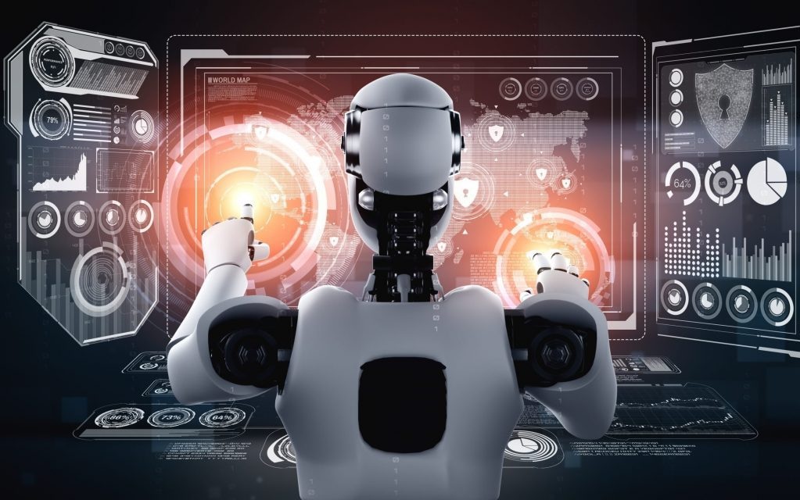

# Research Paper on Emerging Threats and Countermeasures

## Introduction

As technology advances, new opportunities and risks in network security are appearing. Three major developments are changing the way we need to protect networks and data. First, AI-driven attacks are becoming a big concern. These use artificial intelligence to make cyberattacks smarter and more efficient, which can be very challenging to defend against. Second, quantum computing could soon break the types of encryption we currently rely on to keep information safe. This means that all our private communications could potentially be exposed. Lastly, as blockchain technology becomes more common, vulnerabilities in smart contracts are a growing risk. These are programs that run automatically and can handle money or sensitive information. If they have flaws, the consequences can be severe and irreversible. This paper will look more closely at these threats, review how we can guard against them, and suggest ways for organizations to strengthen their security.

## 1. AI-driven Attacks

##### **_Expanded Threat Analysis:_**

As artificial intelligence and machine learning technologies advance, cybercriminals could leverage these tools to launch more sophisticated and automated attacks, making them harder to detect and counter. AI-driven attacks harness the power of machine learning (ML) and artificial intelligence (AI) to execute sophisticated cyberattacks. These attacks can be more adaptive, persistent, and evasive than traditional automated attacks. AI can be used to craft personalized phishing emails by analyzing social media behavior, automate the discovery of vulnerabilities at scale, or even manipulate biometric systems. The adaptability of AI means that it can learn from defensive responses and alter its strategies in real-time, posing a significant challenge for traditional security measures.

##### **_Refined Countermeasures:_**

###### _Advanced Detection Systems:_

Utilizing AI-driven security systems that continuously learn and adapt to new threats can potentially keep pace with AI-enhanced cyberattacks. These systems analyze vast amounts of data from network traffic to identify unusual patterns that might indicate a breach.

###### _AI Security Hygiene:_

Just as attackers use AI, defenders can use it to enhance their predictive capabilities. This involves training defensive AI systems with diverse datasets to avoid biases and vulnerabilities that attackers might exploit.

###### _In-depth Evaluation:_

While AI in cybersecurity is a promising frontier, it demands high levels of data integrity and sophisticated model training to prevent adversaries from exploiting the system itself. The computational overhead and the need for specialized talent to maintain AI-driven defenses are also significant considerations.

##### **_Enhanced Recommendations:_**

To defend against the future cybersecurity threat of AI-powered attacks, organizations must embrace AI in their defensive strategies. AI can be used to detect and respond to threats more effectively, identify anomalous behavior, and enhance threat intelligence sharing. Additionally, investing in AI-enabled security solutions can help organizations stay ahead of increasingly sophisticated AI-driven attacks. Collaboration between the cybersecurity community, industry stakeholders, and governments is essential to establish regulations and standards to counter AI-powered threats responsibly.

## 2. Quantum Computing Vulnerabilities

##### **_Expanded Threat Analysis:_**

Quantum computers are designed to use quantum physics for computing, which introduces unprecedented capabilities over traditional computation methods. Quantum computing has the power to transform drug research, energy use, manufacturing, cyber security and communications, as well as AI applications, autonomous-vehicle navigation, and financial modelling. The advent of quantum computing could revolutionize many fields due to its immense processing power, but it also threatens to break the cryptographic backbones of current security systems. Quantum computers can solve problems like integer factorization exponentially faster than classical computers, potentially rendering current encryption obsolete. This capability threatens everything from financial transactions to government secrets protected by encryption.

##### _**Refined Countermeasures:**_

###### _Early Adoption of Quantum-Safe Protocols:_

It's not enough to wait for standards to be finalized. Organizations should begin experimenting with quantum-safe protocols now to understand how they will integrate with existing systems.

###### _Regular Cryptographic Updates:_

As quantum computing evolves, so too should cryptographic practices. This involves staying ahead of potential quantum threats by regularly updating cryptographic methods and keys.

###### _In-depth Evaluation:_

Transitioning to quantum-resistant cryptography involves significant challenges, including compatibility issues with existing infrastructure and the computational burden of more complex algorithms. However, the risk of not updating cryptographic standards is far greater, potentially exposing all past communications to retroactive decryption.

##### _**Enhanced Recommendations:**_

Organizations should participate in quantum computing research and development to stay at the forefront of emerging cryptographic methods. Proactive investment in quantum cryptography and encryption agility can ensure a smoother transition to a post-quantum era.

##### _**When should companies implement quantum risk management?**_

The answer is now. While quantum computing may seem like a futuristic science fiction concept, the technology is poised to exert major consequences across today’s cyber security capabilities. KPMG believes innovation to protect against quantum cyber threats is needed without delay.

## 3.Smart Contract Vulnerabilities on Blockchain Platforms

##### **_Expanded Threat Analysis:_**

Smart contracts are autonomous scripts on blockchain platforms that execute transactions without human intervention. However, they are as vulnerable to bugs and exploits as any other software. Given the immutable nature of blockchains, any flaw in a smart contract can be disastrous and irreversible, leading to significant financial losses or data breaches.

##### **_Refined Countermeasures:_**

###### _Enhanced Developer Training:_

Smart contract developers must be well-versed in security best practices and the specific pitfalls of blockchain programming. This involves detailed knowledge of potential attack vectors and how to code defensively against them.

###### _Community Audits:_

Leveraging the blockchain community to conduct security audits can help identify vulnerabilities before deployment. Open-source collaboration allows for a more extensive examination than what might be possible internally.

###### _In-depth Evaluation:_

While tools like formal verification offer a high level of security assurance, the complexity and expertise required can be a barrier. Regular audits and testing are necessary, but they must keep pace with the continuous evolution of attack methods in the blockchain space.

##### **_Enhanced Recommendations:_**

Continuous education on the latest blockchain security developments and active engagement with the blockchain security community are essential. Implementing multi-layered security approaches, including both automated tools and human oversight, can mitigate the risks associated with smart contract vulnerabilities. As the technology continues to evolve, new attack vectors and vulnerabilities are likely to emerge, and it’s important for developers and users to stay vigilant and take appropriate security measures to protect their assets.

#### References

[1] https://www.linkedin.com/pulse/ai-powered-attacks-future-threats-cyber-cystel/  
[2] https://www.redasiainsurance.com/ai-attacks/  
[3] https://kpmg.com/au/en/home/insights/2024/04/cyber-security-risk-from-quantum-computing.html  
[4] https://www.techtarget.com/searchsecurity/tip/Smart-contract-vulnerabilities-and-how-to-mitigate-them  
[5] https://www.linkedin.com/pulse/top-5-security-risks-blockchain-smart-contracts-shazia-imam-fvk7f/
